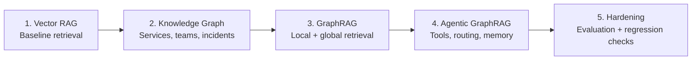

# Hands-On Agentic GraphRAG

Supporting repository for the O'Reilly live workshop:
[Hands-On Agentic GraphRAG](https://learning.oreilly.com/live-events/hand-on-agentic-graphrag/0642572339340/).

This repo is a five-part, notebook-first workshop that takes learners from a
standard vector RAG baseline to a graph-aware, agentic incident investigation
system with memory and evaluation.

## Workshop Flow

## Open the Labs in Colab

Run the notebooks in order. Each lab builds the concepts used by the next one.

| Lab | Open | What it teaches | Main output |
| --- | --- | --- | --- |
| 1. Vector RAG and Its Limitations |  | Builds a flat document corpus from incident data, embeds it, retrieves similar text, and shows where vector-only retrieval struggles with multi-hop operational questions. | A working vector RAG baseline and a clear motivation for graph structure. |
| 2. Knowledge Graph |  | Converts services, teams, people, dependencies, deployments, and incidents into a traversable knowledge graph. | `incident_knowledge_graph.graphml` generated in the notebook. |
| 3. GraphRAG |  | Combines graph traversal with semantic retrieval, then adds community detection and map-reduce style global retrieval. | Local GraphRAG, global GraphRAG, and community summaries. |
| 4. Agentic GraphRAG |  | Wraps retrieval skills as tools and uses an agent loop to route incident questions across vector, graph, runbook, and memory capabilities. | An autonomous incident commander with episodic memory. |
| 5. Evaluation Harness |  | Compares vector RAG, GraphRAG, and agentic GraphRAG against golden questions, then demonstrates a live knowledge update and regression test. | Evaluation results and production hardening checklist. |

## Credentials Needed

Some labs call Gemini and use Hugging Face models. In Colab, add these secrets
before running the notebooks:

| Secret | Used for |
| --- | --- |
| `GOOGLE_API_KEY` | Gemini generation through the Google Generative AI API. |
| `HF_TOKEN` | Hugging Face model access for embedding and local model setup. |

In Colab, open the left sidebar, choose **Secrets**, add both names, and enable
notebook access.

## Data Availability

All workshop data and helper files are included in this repository. When a lab
is opened directly in Colab, the notebook checks for its required companion
files and downloads them from this GitHub repo if they are missing. Learners do
not need to upload JSON, GraphML, ZIP, or Python helper files manually.

The only manual setup required is adding the API secrets above. The Colab and
auto-download links will work after this repository is pushed to GitHub on the
`main` branch.

## Repo Map

### `1.Vector_RAG/`

| File | Link | Purpose |
| --- | --- | --- |
| `01_vector_rag_limitations.ipynb` | [Colab](https://colab.research.google.com/github/AmmarMohanna/oreilly-agentic-graphrag/blob/main/1.Vector_RAG/01_vector_rag_limitations.ipynb) | Starts the workshop with the incident knowledge base, builds a FAISS vector index, and demonstrates retrieval-augmented generation over flat text. |
| `data.zip` | [GitHub](https://github.com/AmmarMohanna/oreilly-agentic-graphrag/blob/main/1.Vector_RAG/data.zip) | Source incident dataset used by Lab 1. It contains service, ownership, team member, dependency, deployment, and past incident JSON files. |

`data.zip` includes:

| File inside ZIP | Purpose |
| --- | --- |
| `data/system.json` | Service catalog for Auth Service, API Gateway, Database Service, and Cache Service. |
| `data/ownership.json` | Maps teams to the services they own. |
| `data/team_members.json` | Lists the people on each operational team. |
| `data/dependencies.json` | Describes service-to-service dependencies. |
| `data/deployment_events.json` | Captures recent deployments by team. |
| `data/past_incidents.json` | Historical incidents used for retrieval and reasoning exercises. |

### `2.Knowledge_Graph/`

| File | Link | Purpose |
| --- | --- | --- |
| `02_knowledge_graph.ipynb` | [Colab](https://colab.research.google.com/github/AmmarMohanna/oreilly-agentic-graphrag/blob/main/2.Knowledge_Graph/02_knowledge_graph.ipynb) | Builds the first explicit graph representation, validates schema assumptions, visualizes relationships, and exports the graph for later labs. |
| `incident_knowledge_graph.graphml` | [GitHub](https://github.com/AmmarMohanna/oreilly-agentic-graphrag/blob/main/2.Knowledge_Graph/incident_knowledge_graph.graphml) | GraphML export generated by Lab 2. Useful for inspecting or reusing the graph outside the notebook. |
| `knowledge_graph.png` | [GitHub](https://github.com/AmmarMohanna/oreilly-agentic-graphrag/blob/main/2.Knowledge_Graph/knowledge_graph.png) | Static graph visualization generated by Lab 2. Useful for slides, quick review, and workshop discussion. |

### `3.Graphrag/`

| File | Link | Purpose |
| --- | --- | --- |
| `03_graphrag.ipynb` | [Colab](https://colab.research.google.com/github/AmmarMohanna/oreilly-agentic-graphrag/blob/main/3.Graphrag/03_graphrag.ipynb) | Implements local GraphRAG for neighborhood questions and global GraphRAG for community-level summaries. |
| `incident_knowledge_graph.graphml.xml` | [GitHub](https://github.com/AmmarMohanna/oreilly-agentic-graphrag/blob/main/3.Graphrag/incident_knowledge_graph.graphml.xml) | Prebuilt incident graph with 28 nodes and 58 edges, used so learners can run Lab 3 without regenerating the graph. |
| `community_summaries.json` | [GitHub](https://github.com/AmmarMohanna/oreilly-agentic-graphrag/blob/main/3.Graphrag/community_summaries.json) | Saved summaries for detected graph communities, used by the global retrieval section. |

### `4.Agentic_graphrag/`

| File | Link | Purpose |
| --- | --- | --- |
| `04_agentic_graphrag.ipynb` | [Colab](https://colab.research.google.com/github/AmmarMohanna/oreilly-agentic-graphrag/blob/main/4.Agentic_graphrag/04_agentic_graphrag.ipynb) | Turns retrieval functions into tools, adds an agentic control loop, and introduces episodic memory for previous investigations. |
| `incident_knowledge_graph.graphml.xml` | [GitHub](https://github.com/AmmarMohanna/oreilly-agentic-graphrag/blob/main/4.Agentic_graphrag/incident_knowledge_graph.graphml.xml) | Same 28-node, 58-edge graph packaged with Lab 4 for the agent tools. |

### `5.Hardening_Production/`

| File | Link | Purpose |
| --- | --- | --- |
| `05_evaluation_harness.ipynb` | [Colab](https://colab.research.google.com/github/AmmarMohanna/oreilly-agentic-graphrag/blob/main/5.Hardening_Production/05_evaluation_harness.ipynb) | Runs a small evaluation harness across the three RAG systems and demonstrates live graph updates with regression checks. |
| `rag_systems.py` | [GitHub](https://github.com/AmmarMohanna/oreilly-agentic-graphrag/blob/main/5.Hardening_Production/rag_systems.py) | Helper module loaded by Lab 5. It prepares `vector_rag(query)`, `graph_rag(query)`, and `run(query)` for side-by-side evaluation. |
| `challenge_set.json` | [GitHub](https://github.com/AmmarMohanna/oreilly-agentic-graphrag/blob/main/5.Hardening_Production/challenge_set.json) | Golden question set covering local, temporal, multi-hop, and memory-based questions. |
| `eval_results.json` | [GitHub](https://github.com/AmmarMohanna/oreilly-agentic-graphrag/blob/main/5.Hardening_Production/eval_results.json) | Saved evaluation output from a previous run, useful as an example of expected harness output. |
| `incident_knowledge_graph.graphml.xml` | [GitHub](https://github.com/AmmarMohanna/oreilly-agentic-graphrag/blob/main/5.Hardening_Production/incident_knowledge_graph.graphml.xml) | Prebuilt incident graph used by the production hardening lab. |
| `episodic_memory.graphml.xml` | [GitHub](https://github.com/AmmarMohanna/oreilly-agentic-graphrag/blob/main/5.Hardening_Production/episodic_memory.graphml.xml) | Memory graph with 11 nodes and 10 edges representing prior investigation episodes. |

### Workshop deck

| File | Link | Purpose |
| --- | --- | --- |
| `Agentic GraphRAG Live Course.pdf` | [GitHub](https://github.com/AmmarMohanna/oreilly-agentic-graphrag/blob/main/Agentic%20GraphRAG%20Live%20Course.pdf) | Slide deck for the live course narrative, diagrams, and presenter framing. |

## What Learners Should Understand by the End

By the end of the workshop, participants should be able to explain and build:

1. Why vector RAG alone can miss causal, ownership, temporal, and multi-hop relationships.
2. How a knowledge graph makes operational relationships explicit and traversable.
3. How GraphRAG combines semantic search with graph neighborhoods and communities.
4. How an agent can choose the right retrieval skill for an incident investigation.
5. How memory and evaluation turn a demo into something closer to a production workflow.

## Suggested Presenter Timing

| Segment | Focus | Suggested time |
| --- | --- | --- |
| Setup and Lab 1 | Baseline vector RAG and its failure modes | 25-30 min |
| Lab 2 | Graph construction and traversal | 25-30 min |
| Lab 3 | Local and global GraphRAG | 35-40 min |
| Lab 4 | Agentic routing and episodic memory | 35-40 min |
| Lab 5 | Evaluation, live update, production checklist | 25-30 min |

## Recommended Run Order

1. Open Lab 1 in Colab and add `GOOGLE_API_KEY` plus `HF_TOKEN` to Secrets.
2. Run Lab 1 to see the baseline and limitations.
3. Run Lab 2 to build the graph model.
4. Run Lab 3 to compare local and global graph retrieval.
5. Run Lab 4 to turn retrieval into agent tools with memory.
6. Run Lab 5 to evaluate behavior and discuss production hardening.

## Notes for Instructors

- The notebooks are designed for a live workshop. Keep the path linear unless
  learners already know vector search and knowledge graphs.
- The graph files are included so later labs can run even if a learner falls
  behind during graph construction.
- The challenge set in Lab 5 is intentionally small. It is meant to teach the
  evaluation pattern, not to be a complete benchmark.
- If you fork this repository, update the Colab links to point to your fork:
  `https://colab.research.google.com/github/<owner>/<repo>/blob/main/<path>.ipynb`.
